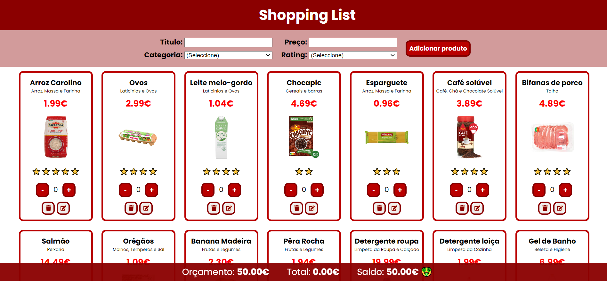

# Shopping list

This is a simple shopping list app built with React. Each product shows info concerning its category, price and rating. In the footer, you can consult your current budget ("orçamento"), total and the balance ("saldo"). Below you can see a snapshot of the app and check its main functionalities.

## Functionalities available

### Change product quantity

Increase or decrease the amount of each product by clicking in the "+" and "-" buttons, respectively.

### Remove and edit products

You can also remove a product from the list by clicking in the trash bin button or edit its price by clicking in the pencil button.

### Add your own products

If you wish, add your products by filling up the form (right below the header). Once you submit the form, your product should be listed at the end of the page.

## Getting Started with Create React App

This project was bootstrapped with [Create React App](https://github.com/facebook/create-react-app).

In the project directory, you can run:

### `npm start`

Runs the app in the development mode.\
Open [http://localhost:3000](http://localhost:3000) to view it in your browser.

The page will reload when you make changes.\
You may also see any lint errors in the console.
